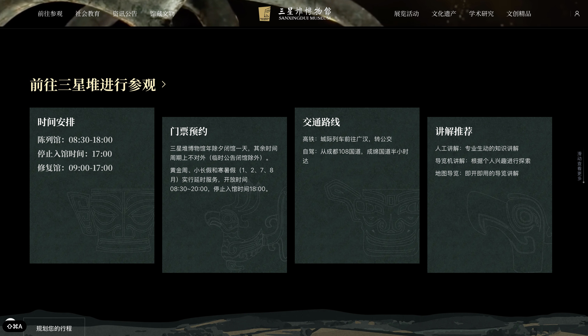
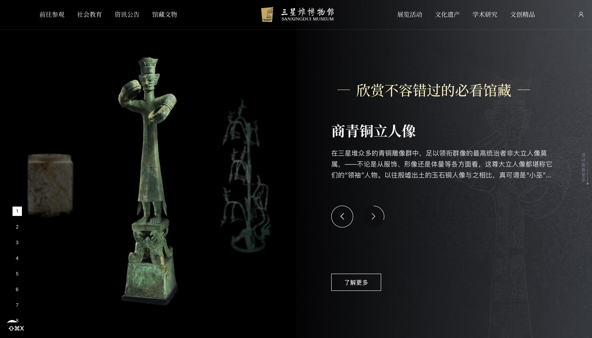
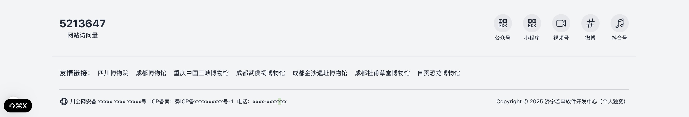

# 三星堆文化数字化展示平台

本项目基于 Next.js 构建，旨在以现代 Web 技术和交互动画，生动展现三星堆的历史文化。**当前仅实现了首页，其他页面为占位或未开发，项目主要聚焦于首页的视觉与交互体验。**

## 首页功能亮点
- **动态视频背景**：沉浸式视觉体验，突出三星堆文化氛围。
- **品牌标识与入口**：展示项目 logo、标题与进入按钮。
- **参观信息卡片**：包含开放时间、门票预约、交通路线、讲解推荐等信息。
- **馆藏文物轮播**：精选代表性文物，支持轮播浏览与详细介绍。
- **全局导航与页脚**：导航仅作展示，页脚含社交媒体、友情链接、备案与联系方式。
- **Tailwind CSS 原子化编程**：全站采用 Tailwind 原子类，样式灵活高效。

## 真机截图






## 技术栈
- [Next.js 15](https://nextjs.org/)：服务端渲染与静态生成
- [React 19](https://react.dev/)
- [Tailwind CSS 3](https://tailwindcss.com/)：原子化 CSS 框架
- [Framer Motion](https://www.framer.com/motion/)：动画与交互
- [GSAP](https://greensock.com/gsap/)：高级动画库
- [Heroicons](https://heroicons.com/)、[Radix Icons](https://icons.radix-ui.com/)
- [Locomotive Scroll](https://locomotivemtl.github.io/locomotive-scroll/)：平滑滚动体验
- TypeScript、ESLint、PostCSS

## 目录结构（核心部分）
```
├── src/
│   └── app/
│       ├── page.tsx           # 首页
│       └── ui/                # 首页相关复用组件
├── public/                    # 静态资源（图片、视频等）
├── tailwind.config.ts         # Tailwind 配置
├── package.json               # 依赖与脚本
```

## 使用方法
本项目推荐使用 [bun](https://bun.sh/) 进行包管理和开发。

### 安装依赖
```bash
bun install
```

### 启动开发服务器
```bash
bun run dev
```

## 主要依赖说明
- **next**：React 应用的服务端渲染与路由
- **react / react-dom**：核心 UI 框架
- **tailwindcss**：原子化 CSS
- **framer-motion**、**gsap**：动画与动效
- **@heroicons/react**、**@radix-ui/react-icons**：图标库
- **locomotive-scroll**：平滑滚动体验
- **typescript**：类型安全

## Tailwind CSS 原子化编程
本项目所有样式均采用 Tailwind CSS 原子类实现，组件化开发，样式与结构解耦，便于快速开发和维护。自定义配置见 `tailwind.config.ts`。
